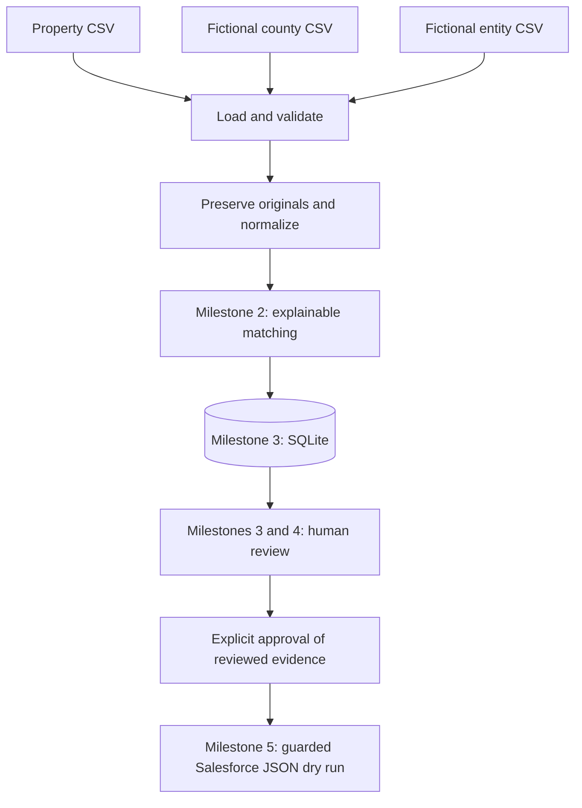

# Net-Lease Ownership Intelligence POC

A portfolio proof of concept for reconciling commercial-property ownership
evidence before human review and a guarded Salesforce payload export.

**Current milestone: 1 — scaffolding, source models, fictional data, ingestion,
normalization, and tests.** Matching, persistence, review, Streamlit, and export
are not implemented yet. No approval state or Salesforce payload is created.

## Problem

Ownership records can disagree across county and corporate sources. Formatting
differences can conceal agreement, while similar company names, shared registered
agents, and related entities can create misleading apparent matches. Finding
data does not make it trusted. The eventual workflow must preserve evidence,
explain its recommendation, and require a human decision before export.

## Run Milestone 1

Requires Python 3.11 or later. From this project directory:

```bash
python3 -m venv .venv
source .venv/bin/activate
python -m pip install -r requirements.txt
python -m pytest
```

In this workspace, a working `.venv` has already been created with the bundled
Python runtime. To rerun tests without using macOS's developer-tools-dependent
system Python, run `.venv/bin/python -m pytest` from this directory. Milestone 1
verification completed with **79 passing tests**, Python 3.12.14, and pytest 8.4.2.

Load the sample data in Python after installing the project:

```python
from net_lease_ownership.ingestion import load_dataset

dataset = load_dataset("data")
print(len(dataset.properties))  # 15
county = dataset.county_records[0]
print(county.owner_name)         # ABC Medical Holdings LLC
print(county.owner_normalized)   # abc medical holdings llc
print(county.owner_comparison)   # abc medical holdings
```

The application uses the Python standard library at this stage. `pytest` is a
development dependency. Streamlit will be added in Milestone 4. No credentials,
AI API, environment variables, live feeds, or Salesforce org are needed.

## Project layout

```text
net-lease-ownership-intelligence/
    README.md
    requirements.txt
    pyproject.toml
    .gitignore
    .env.example
    data/
        properties.csv
        county_records.csv
        entity_records.csv
        SCENARIOS.md
    src/net_lease_ownership/
        __init__.py
        models.py
        normalization.py
        ingestion.py
    tests/
        test_models.py
        test_normalization.py
        test_ingestion.py
```

The named package under `src/` supports predictable imports and keeps business
logic independent of the future UI. Modules are added as their milestone needs
them, rather than creating nonfunctional review or export placeholders.

## Architecture and milestone boundaries



1. **Milestone 1:** scaffold, source models, samples, normalization, tests.
2. **Milestone 2:** reconciliation rules, configurable policy, explainable scores.
3. **Milestone 3:** SQLite evidence/results and append-only human decisions.
4. **Milestone 4:** Streamlit dashboard, review detail, and approved-record view.
5. **Milestone 5:** validated export of explicitly approved evidence only.
6. **Milestone 6:** documentation, cleanup, full tests, and GitHub readiness.

Each milestone ends with tests and product-owner review before the next begins.

For Milestone 1 review, inspect `data/SCENARIOS.md`, the original feed values in
the three CSVs, and the normalization examples in `tests/test_normalization.py`.
Confirm that the cases resemble the ownership research problems you want to
explain in an interview. The repository is initialized locally on `main`; no
commit, GitHub repository, or remote publication has been created.

## Models and source provenance

`Property`, `CountyRecord`, and `EntityRecord` are immutable dataclasses. Feed
records retain source name, source-record ID, source-as-of date, and original
values. Derived normalized values are computed at construction and cannot be
supplied independently. County mailing addresses and entity registered addresses
remain separate fields because they describe different roles.

Company names have a suffix-preserving normalized value and a comparison value
that removes a trailing legal suffix. A separate normalized-record hierarchy is
unnecessary for this small POC. `NORMALIZATION_VERSION` identifies the current
algorithm; recording it with persisted evidence is planned for Milestone 3.

Disposition and review-status enums reserve separate concepts for later work:
`ready_for_review` is not approval. Source records carry no review status. The
later review layer must default to `unreviewed`, require a human decision, and
bind approval to the specific evidence reviewed. Changed evidence requires new
review. These controls are planned, not implemented in Milestone 1.

## Sample data and validation

The fixtures contain 15 properties, 14 county rows, and 15 entity candidates.
All property/entity/agent/tenant names and street addresses are fictional. See
[the scenario guide](data/SCENARIOS.md) for the intended cases, including missing
sources, conflicting names, shared addresses, possible related entities, and
multiple candidates. Scenario expectations are documentation, not match outputs.

Feed `property_id` values provide explicit research-packet associations. They do
not establish ownership and avoid pretending to implement live candidate discovery.
Multiple entity candidates for one property are allowed.

Loaders reject incorrect/duplicate headers, malformed rows, duplicate identifiers,
invalid dates, blank required fields, and unknown property associations. A source
with missing owner/entity or address evidence is retained so future matching can
explain the missing evidence. A header-only feed is valid; an empty property list
is not. Original strings are retained, including whitespace and punctuation.

## Deterministic normalization

- Unicode compatibility normalization, case folding, and whitespace cleanup.
- Dotted legal abbreviations such as `L.L.C.` become `llc`.
- Terminal `Incorporated`, `Corporation`, and `Limited` become `inc`, `corp`, and `ltd`.
- Ampersands become `and`; apostrophes/periods are removed; other punctuation
  becomes a word separator.
- Optional removal of one trailing legal suffix keeps meaningful name tokens.
- Common street and directional abbreviations are normalized before the first
  comma. `Ste.` and `#` become `suite`; apartment identifiers stay distinct.
- House numbers, unit numbers, city/state text, and postal-code digits remain.
- Blank values stay blank. Two missing addresses must not count as corroboration.

Normalization does not expand `Med` to `Medical`, singularize `Properties`,
geocode addresses, establish identity, or infer parent/child relationships.
Abbreviation maps are local constants in Milestone 1. Matching thresholds, score
weights, and policy configuration will be considered in Milestone 2. There is no
matching algorithm or confidence calculation in this milestone.

## Limitations and safety boundaries

Address normalization is an illustrative US-format heuristic, not postal
validation. Inputs should use comma-separated street/city/state segments.
Directional street names, unusual punctuation, legal-name conventions, and
international addresses may need different rules. Address equality is not proof
of ownership; address disagreement is not necessarily an ownership conflict.

There is no corporate hierarchy model. A possible parent remains a research
hint and must never silently replace a property-specific ownership entity.

No live records are scraped, no production systems are connected, and no LLM is
used for normalization. The future matching score will be an operational review
priority, not a statistically calibrated probability. The future export layer
must require persisted human approval and validate fields, with dry-run output
only in V1.

## How Codex was used

The product owner supplied the business problem, specification, milestone
boundaries, and approved design. Codex served as the primary coding agent for
Milestone 1: scaffolding the project, implementing source models and loaders,
creating fictional fixtures, writing normalization and tests, and reviewing
implementation decisions. Codex does not independently own the project.

## Future work

After the six milestones: live county/corporate adapters, duplicate detection,
optional AI assistance for ambiguous candidates, richer audit evidence, scheduled
ingestion, and a separately authorized real Salesforce integration. None of
these additions is required for the current milestone.
