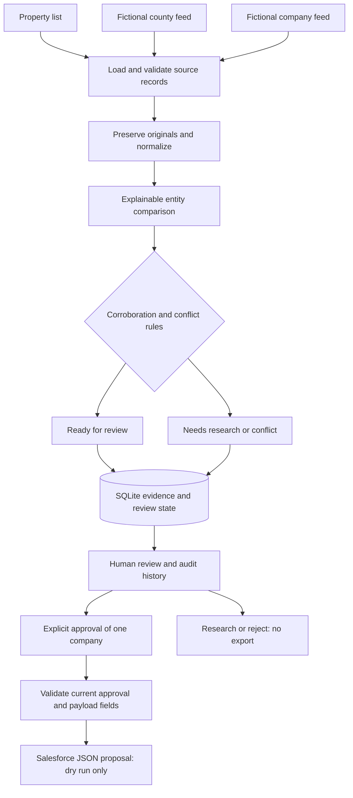

# Net-Lease Ownership Intelligence POC

A local portfolio proof of concept for reconciling commercial-property ownership
records, reviewing uncertain matches, and proposing a Salesforce upsert only
after explicit human approval.

## Why this workflow matters

County and corporate records can disagree. Formatting differences can hide a
match, while similar names, shared addresses, registered agents, and related
companies can create false positives. Finding a record does not make it trusted.
This workflow preserves evidence, explains its recommendation, and separates
matching from human decisions and export eligibility.

## Quick start

Requires Python 3.11 or later. Run these commands from the repository directory
on macOS or Linux:

```bash
python3 -m venv .venv
source .venv/bin/activate
python -m pip install -r requirements.txt
python -m pytest
PYTHONPATH=src python -m streamlit run src/net_lease_ownership/app.py
```

On Windows, create the environment with `py -m venv .venv` and activate with
`.venv\Scripts\Activate.ps1`. Set `$env:PYTHONPATH = "src"` before running the
Streamlit command without the `PYTHONPATH=src` prefix. Windows is not locally verified.

Open `http://127.0.0.1:8501`, then click **Load sample property records**.
An untouched sample portfolio contains 15 properties: 6 ready for review,
8 needing research, 1 conflict, and 0 approved. Matching never approves a record.
An existing database keeps decisions when reloaded with identical evidence.

The app provides a dashboard, filtered review queue, compact record comparisons,
human decisions, audit history, and downloads for valid approvals. Start with
[the isolated demo walkthrough](docs/DEMO.md), then see [UI instructions](docs/UI.md).

The default database is `ownership.sqlite3` in the repository. `NLOI_DATABASE`
can select another database; its parent directory must exist. `.env.example`
documents this optional setting. The app does not automatically load `.env` files.
No credentials, AI API, or Salesforce org are required. The Streamlit server
binds to localhost and disables usage statistics.

## Architecture



The business logic uses the Python standard library. Streamlit supplies the UI;
pytest supplies development tests. SQLite stores immutable evidence snapshots,
current review state, and append-only audit events. There is no ORM, background
worker, external matcher, or separate normalized-record hierarchy.

| Area | Implementation and details |
|---|---|
| Inputs and models | `ingestion.py`, `models.py`; [fictional scenarios](data/SCENARIOS.md) |
| Normalization and matching | `normalization.py`, `matching.py`, `policy.py`; [rules and score formula](docs/MATCHING.md) |
| Persistence and review | `repository.py`, `review.py`, `review_cli.py`; [schema and commands](docs/REVIEW.md) |
| Browser workflow | `app.py`; [UI and decision rules](docs/UI.md) |
| Guarded proposal | `salesforce.py`; [field mapping and export validation](docs/SALESFORCE.md) |
| Verification | `tests/`, `.github/workflows/tests.yml`; [validation record](docs/VALIDATION.md) |

## Matching strategy

Names and addresses are normalized deterministically while originals remain
intact. Company-name comparison handles punctuation, casing, dotted LLC forms,
and a trailing legal suffix. Address comparison handles common US abbreviations
while retaining house, suite, city, and postal identifiers.

Name similarity averages character comparisons in both directions. The default
workflow score is `70 × name similarity + 30 × address agreement`, with missing
components contributing zero. The score prioritizes review; it is not a
statistically calibrated probability or proof of ownership.

Readiness requires more than a high score: two useful names, comparable agreeing
addresses, acceptable company status, compatible legal/name identifiers, and
exact normalized names or an explicitly allowed minor word variation. Ambiguous
company candidates and multiple county owners require research. A shared
address or registered agent never establishes ownership by itself.

Thresholds, score weights, accepted statuses, allowed word variations, and generic
name tokens are configurable in `config/matching.toml`. Abbreviation maps remain
versioned normalization constants. See [matching details](docs/MATCHING.md) for
ranking, conservative guards, and known false-positive risks.

## Safety and data-quality controls

- Preserve original and normalized records, source names/IDs/dates, every
  comparison, discrepancies, and policy/algorithm versions.
- Keep source data, matching recommendations, human review state, and export
  eligibility separate. A ready-for-review recommendation is not approval.
- Require an explicit decision, reviewer name, and company selection to approve.
  Approval overriding property or selected-company warnings also requires a note.
- Bind decisions to the reviewed evidence snapshot and revision. Changed evidence
  invalidates prior decisions; stale submissions cannot overwrite another review.
  Identical reimports preserve decisions and history.
- Export only a current valid approval with a matching human audit event. Use the
  selected company's fields and score; retain provenance and override rationale.
  Rejection, research, and changed evidence invalidate subsequent exports.
- Support dry-run JSON only. There is no Salesforce transport or live-write mode.
  A downloaded proposal is a historical artifact, not authorization for a future
  production write.
- Validate input structure and protect source/configuration/database files from
  report path collisions. Report replacement is atomic; malformed approvals fail
  export validation.

## Command-line workflow

Generate a matching report, load SQLite evidence, inspect a property, and inspect
its history:

```bash
PYTHONPATH=src .venv/bin/python -m net_lease_ownership
PYTHONPATH=src .venv/bin/python -m net_lease_ownership.review_cli load
PYTHONPATH=src .venv/bin/python -m net_lease_ownership.review_cli show P001
PYTHONPATH=src .venv/bin/python -m net_lease_ownership.review_cli history P001
```

The matching report goes to ignored `exports/matching_report.json`. It retains
all comparisons and never approves anything. See [review commands](docs/REVIEW.md)
for explicit decisions using the snapshot/revision from `show`. After approval:

```bash
PYTHONPATH=src .venv/bin/python -m net_lease_ownership.review_cli export P001
```

Export prints a proposed JSON upsert, or a clear error if ineligible. Its fields
are a proposed custom-field mapping, not a validated Salesforce REST request.
Object name, field types/lengths, external-ID uniqueness, and permissions must be
checked before a separately authorized future integration.

## Verification and GitHub readiness

The local full suite has **414 passing tests**, verified with Python 3.12.14,
pytest 8.4.2, and Streamlit 1.64.0. Tests use temporary databases and include
malformed inputs, false-positive guards, real review transitions, stale sessions,
rollback, audit preservation, guarded proposals, and actual UI download bytes.
An end-to-end subprocess test covers report → import → approval → export → revoke.

The GitHub Actions workflow installs dependencies, checks them, and runs pytest
on Python 3.11 and 3.12. It is configured locally; no remote run is claimed before
publication. Dependency versions are bounded rather than fully locked. See
[validation and reproducibility limits](docs/VALIDATION.md).

Generated databases, reports, virtual environments, caches, and local environment
files are ignored by Git. Fixtures are fictional. 

## Known limitations

This POC does not prove legal ownership accuracy. Feed property IDs associate
records with fictional research packets; there is no live candidate discovery.
US address normalization is illustrative, not postal validation. Source labels
cannot establish independent upstream data, and source dates cannot establish
current ownership. Human override notes are recorded, not independently verified.

There is no parent/child account model. A parent company and a property-specific
LLC can remain separate legal owners even when names or addresses overlap.
Related-company evidence is a research hint and never substitutes the parent.

Reviewer names are caller-supplied, not authenticated. SQLite integrity checks
are not tamper-proof against someone with filesystem/database access. There is
no production hosting, access-control layer, live Salesforce schema validation,
or mechanism to recall an already downloaded proposal.

## How Codex was used

The product owner supplied the business problem, specification, milestone
boundaries, and design decisions. Codex served as the primary coding agent to
scaffold the repository, implement modules, create fictional fixtures, write
and run tests, diagnose failures, refine matching and review controls, build the
Streamlit workflow, add guarded export, and review/refactor its own changes.

Deterministic logic handles deterministic normalization and matching rules.
No LLM is called at runtime. Optional AI assistance could later help investigate
ambiguous cases while leaving human approval and export guards intact.

## Future improvements

Live county/corporate adapters, commercial-data feeds, duplicate detection,
optional AI-assisted research, authenticated reviewers, richer audit evidence,
scheduled ingestion, and a separately authorized Salesforce REST adapter.
